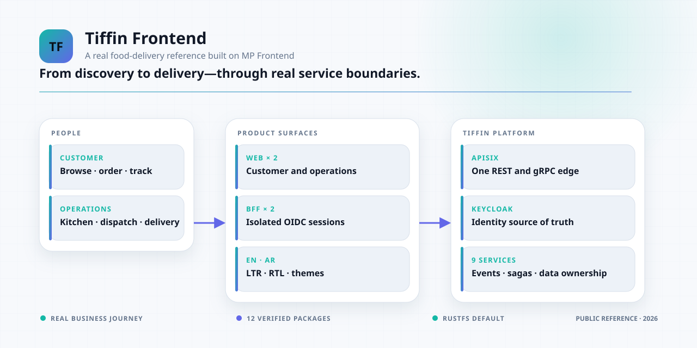
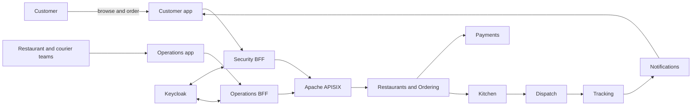

<div align="center">

# MP Frontend · Tiffin Reference

**A real food-delivery product built on MP Frontend and the MP Core Tiffin microservices sample.**

Independent customer and operations applications, secure OIDC sessions, generated API contracts,
realtime delivery state, English/Arabic localization, and consumer-owned theming.

[](https://github.com/panahister/mpfrontend-tiffin-reference/actions/workflows/ci.yml)
[](LICENSE)
[](package.json)
[](#project-status)

[Architecture](docs/ARCHITECTURE.md) ·
[Run locally](docs/LOCAL-DEVELOPMENT.md) ·
[Demo accounts](docs/DEMO-GUIDE.md) ·
[Verification](docs/CI-VERIFICATION.md) ·
[MP Frontend](https://github.com/panahister/mpfrontend) ·
[MP ecosystem](https://github.com/panahister/mpcore/blob/main/docs/architecture/ecosystem.md)

</div>

<picture>
  <source media="(prefers-color-scheme: dark)" srcset="docs/images/ecosystem-dark.svg">
  <source media="(prefers-color-scheme: light)" srcset="docs/images/ecosystem-light.svg">
  
</picture>

This repository proves that MP Frontend can be consumed across a real product boundary. It does not
import foundation source or another application's code. The exact prerelease package cohort is vendored
as twelve immutable archives and verified before installation.

The product integrates with the nine-service
[MP Core Tiffin sample](https://github.com/panahister/mpcore-tiffin-sample), a dedicated
[Keycloak identity source](https://github.com/panahister/tiffin-keycloak), and a declarative
[APISIX edge](https://github.com/panahister/tiffin-apisix).

## Product surfaces

| Surface | Purpose | Local URL |
|---|---|---:|
| Customer | Discover restaurants, inspect menus, authenticate, order, track, and read notifications | `http://localhost:4411` |
| Operations | Restaurant menu and kitchen work, courier dispatch/position work, and role-aware operational views | `http://localhost:4412` |
| Customer BFF | OIDC session and gateway mediation for the customer application | internal `4511` |
| Operations BFF | OIDC, REST, and gRPC mediation for the operations application | internal `4512` |

City and platform administrators are governance identities for the backend Access boundary; they are not
restaurant or courier operators. The [demo guide](docs/DEMO-GUIDE.md) lists the correct user for each UI.

## End-to-end journey



The demonstrated flow covers anonymous catalog and menu reads, signup and login, order placement, demo
payment outcomes, kitchen acceptance, courier assignment and position, live tracking, completion, and
notifications. Negative paths include validation, payment decline, unavailable courier, role and city
isolation, stale identity claims, service outages, idempotency, and compensation.

## Frontend architecture

- The browser talks to a presentation server, never directly to internal services.
- Provider tokens remain in the Security BFF; the browser receives an opaque application session.
- APISIX is the only public API edge, while every backend validates the bearer token again.
- Customer and operations applications build and deploy independently.
- Selected OpenAPI operations generate TypeScript models, runtime validators, reads, and mutations.
- Product adapters own user experience, localization, and error mapping.
- Realtime state uses ticketed admission, reconnect, replay, and snapshot recovery.
- English and Arabic use direction-aware layout with Light, Dark, and System appearance choices.

Read [Architecture](docs/ARCHITECTURE.md) for the trust boundaries and repository ownership model.

## Design ownership

The public reference contains an independently authored Tiffin sample theme. It contains no private
Figma file key, raw export, binding, generated ownership state, or design provenance from another product.

Teams with an approved design system may use MP Frontend's `existing` source mode in their own repository.
Code-first teams may use `none`. MP Frontend validates reviewed local artifacts; it does not connect to,
mutate, or publish a design file.

## Run the product

The recommended frontend workflow keeps the complete seeded backend in Docker, runs the two web
applications with Next.js hot reload, and supervises their BFFs from this checkout:

```bash
git clone https://github.com/panahister/mpcore-tiffin-sample.git
git clone https://github.com/panahister/mpfrontend-tiffin-reference.git
git clone https://github.com/panahister/tiffin-keycloak.git
git clone https://github.com/panahister/tiffin-apisix.git

cd mpcore-tiffin-sample
scripts/full-demo.sh up-backend

cd ../mpfrontend-tiffin-reference
pnpm install --frozen-lockfile
pnpm dev:product
```

Open Customer at `http://localhost:4411` and Operations at `http://localhost:4412`. Press `Ctrl+C` to
stop the editable frontend; the Docker backend and its data continue running. Stop it without deleting
data with `scripts/full-demo.sh down` from the backend checkout.

Two other supported paths use the same four sibling repositories: backend developers can keep only
dependencies in Docker and debug all nine .NET services on the host, while evaluators can run the entire
product with `scripts/full-demo.sh up`. [Local development](docs/LOCAL-DEVELOPMENT.md) gives the exact
prerequisites, commands, trade-offs, health behavior, and safe stop/reset sequence for all three.

## Quick verification

Prerequisites: Node.js `24.19.0` and pnpm `11.25.0`.

```bash
git clone https://github.com/panahister/mpfrontend-tiffin-reference.git
cd mpfrontend-tiffin-reference
npm install --global pnpm@11.25.0
node scripts/verify-core-artifacts.mjs
pnpm install --frozen-lockfile
pnpm check --skip-nx-cache
```

The gate verifies all twelve MP Frontend archives before running nineteen uncached lint, typecheck, test,
build, generated-contract, and design-theme targets. The exact package lock digest is
`b98535404c82706c548fe741a2f192787e5bf3d689bfaa799d536efe9bf909a0`.

For a full local product run, clone the four related Tiffin repositories as siblings and follow
[Local development](docs/LOCAL-DEVELOPMENT.md).

## Repository map

```text
apps/customer/             customer Next.js application and product adapters
apps/admin/                role-aware operations application and product adapters
bff/                       product-specific Security BFF composition
presentation/              server runtime and public application API
contracts/                 captured OpenAPI and gRPC inputs
packages/dls-adapter/      independently authored Tiffin theme adapter
themes/tiffin-dls/         public semantic theme contract
artifacts/packages/        immutable MP Frontend prerelease cohort
scripts/                   artifact, generated-contract, and theme verification
```

## Project status

This is a public reference proof of concept, not a production service. The source gate and complete local
business journey pass. Production HA, TLS and key custody, load and regional failover, formal accessibility
acceptance, and package-registry distribution remain separate gates. See
[CI verification](docs/CI-VERIFICATION.md) for the exact boundary.

## Contributing and security

Read [CONTRIBUTING.md](CONTRIBUTING.md) before proposing a change. Report vulnerabilities privately as
described in [SECURITY.md](SECURITY.md). Participation is governed by
[CODE_OF_CONDUCT.md](CODE_OF_CONDUCT.md).

## License

Licensed under [Apache License 2.0](LICENSE). Demo people, restaurants, orders, and payment outcomes are
fictional. Menu images are project-owned generated assets with source and SHA-256 provenance in
`apps/customer/public/demo/ASSET-PROVENANCE.md`.
