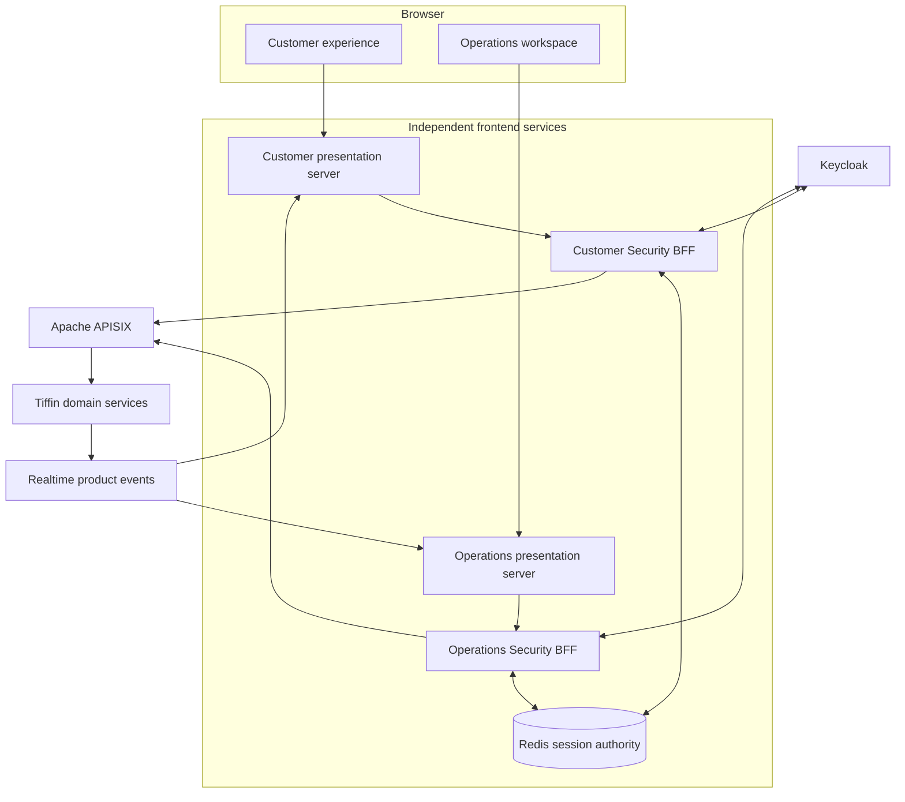
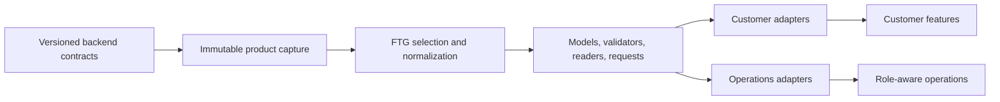

# Architecture

The Tiffin reference is an independent MP Frontend consumer with two separately deployable applications
and two Security BFF compositions. It proves the package boundary against the real Tiffin backend rather
than importing MP Frontend source.

## System context

## Trust boundaries

1. Browser JavaScript never receives a Keycloak token or an internal gateway address.
2. The Security BFF owns OIDC code exchange, encrypted server-side sessions, refresh, and logout.
3. APISIX may validate tokens at the edge, but every domain service validates and authorizes again.
4. The presentation access manifest controls visibility only; backend policy remains authoritative.
5. Customer and operations cookies, origins, BFFs, and application ports are isolated.
6. Generated validators run before a selected request leaves the presentation boundary and after a typed
   response returns.

## Contract flow

The consumer explicitly selects operations. Unsupported schema shapes fail generation rather than
producing permissive code. Generated ownership is checked in CI; product-authored files remain outside
that ownership surface.

## Application ownership

| Area | Owner |
|---|---|
| Authentication and credentials | Keycloak |
| Browser session and provider tokens | Security BFF |
| Edge routing and optional edge token validation | APISIX |
| Business authorization and invariants | Tiffin domain services |
| API schemas | Backend services, captured by this consumer |
| Generated presentation contracts | MP Frontend tooling |
| Product composition and business language | Tiffin customer and operations apps |
| Brand/theme implementation | Tiffin DLS adapter in this repository |
| File bytes and signed upload lifecycle | Tiffin Media service and selected S3-compatible store |

## Identity lifecycle

Keycloak is the source of truth for customer identity and credentials. Signup occurs in the themed
Keycloak flow. A transactional identity-event outbox publishes a privacy-minimal lifecycle event; the
backend Access service maintains an idempotent business projection keyed by the immutable Keycloak
subject. The frontend does not create a second identity source.

## Realtime model

Customer order, tracking, notification, kitchen, and courier views recover through ticketed admission,
bounded replay, and snapshots. Locale and appearance are product preferences; authority is always read
from the current server-side session. A reconnect cannot reuse stale role or tenant state.

## Theme and localization

The repository owns a neutralized Tiffin theme with semantic tokens for Light, Dark, and System modes.
English and Arabic resource catalogs drive visible product text. Layout uses logical properties so RTL is
not a mirrored screenshot but a maintained application mode. Inter and Noto Sans Arabic are licensed and
consumer-owned typography choices.

## Deployment

`compose.local.yaml` packages four independent frontend services. It expects the backend, Keycloak, and
APISIX development stack to be running on the host/sibling repositories. The local topology is intended
for repeatable evaluation and debugging; it is not a production ingress, secret-management, or HA model.
