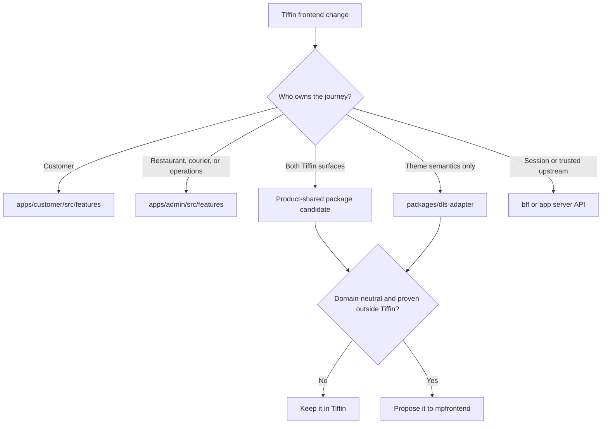

# Tiffin frontend conventions

This is the day-to-day coding contract for Tiffin Customer and Operations. It applies the reusable
[MP Frontend conventions](https://github.com/panahister/mpfrontend/blob/main/docs/FRONTEND-CONVENTIONS.md)
to this repository's real paths, project names, contracts, and verification targets.

Read it before adding a feature, selecting another API operation, introducing a shared package, changing
the DLS adapter, or proposing a change to MP Frontend foundation.

## Where code belongs in this repository



| Concern | Current home | Decision rule |
|---|---|---|
| Customer discovery, ordering, tracking, notifications | `apps/customer/src/features/` | Keep Customer routes, copy, orchestration, and presentation state in Customer |
| Restaurant, kitchen, courier, and operations work | `apps/admin/src/features/` | Keep role-aware operational workflows in Admin; backend permissions remain authoritative |
| Browser-to-product API routes | `apps/*/src/app/api/` and `apps/*/src/api/server/` | Own request limits, contract validation, trusted upstream mapping, and safe error forwarding server-side |
| Selected generated API model | `apps/*/src/features/catalog/model/generated/` | Generated by the app's `ftg.config.json`; never edit manually |
| Stable handwritten contract bridge | `apps/*/src/features/catalog/model/contract-boundary.ts` | Select generated request/resource metadata and validate requests plus successful responses |
| Tiffin visual semantics | `packages/dls-adapter/` and `themes/tiffin-dls/` | Map Tiffin theme semantics only; no API, role, or workflow logic |
| Product-shared capability | A new Tiffin package only after both apps need it | Keep a narrow public API; do not create a generic `utils` package |
| Reusable platform capability | `mpfrontend` only after a separate product shape proves it | No Tiffin routes, copy, roles, endpoints, or brand may enter foundation |

The current repository intentionally has no product-shared package. Duplication between two files is not
enough reason to add one; first prove that Customer and Operations share one stable product concept.

## Separate UI, workflow, contract, and trust

For a normal feature:

- a React component renders validated feature state and emits an intent;
- a feature function owns request sequencing, busy/error/success state, and dependent refreshes;
- `contract-boundary.ts` binds the request to generated metadata and validators;
- `src/api/server/contract-transport.ts` enforces body limits, content type, CSRF/idempotency forwarding,
  trusted upstream selection, and successful-response validation; and
- the backend remains the authority for business rules, roles, and tenant access.

Pull logic out of JSX when it can be tested without rendering, coordinates requests, translates a
technical outcome into a product state, or crosses a trust boundary. Leave simple rendering expressions
in the component. Moving every expression into a helper does not create separation of concerns.

## The Tiffin API-feature path


### 1. Confirm the backend contract

Before editing the UI, record the operation id, method, path, request body profile, success status,
response schema, stable failure identities, role, city behavior, and idempotency expectation. If the
backend contract is missing or ambiguous, resolve it in the backend first.

### 2. Update the captured OpenAPI input

- Customer: `contracts/openapi/presentation/tiffin/openapi.json`
- Operations: `contracts/openapi/presentation/tiffin/admin/openapi.json`

These checked-in files are review inputs. Do not point routine generation at a mutable live endpoint.

### 3. Select the operation

- Customer: `apps/customer/ftg.config.json`
- Operations: `apps/admin/ftg.config.json`

Select only an operation the surface actually uses. Set `body` explicitly when the request is bodyless or
optional JSON; required JSON is the finite default.

### 4. Generate and inspect

```bash
pnpm exec nx run tiffin-customer:ftg-generate
pnpm exec nx run tiffin-admin:ftg-generate
```

Run only the affected target during implementation. Review
`src/features/catalog/model/generated/generation-manifest.json` and the generated diff. Do not edit a
`.gen.*` file.

### 5. Bind and implement

Use the app's `contract-boundary.ts` for request and response selection. Put product orchestration in the
owning feature and keep the component focused on rendering, accessibility, and intent. A request that
must hold provider tokens or an internal origin remains behind the server/BFF boundary.

### 6. Verify from narrow to connected

Customer feature:

```bash
pnpm exec nx run tiffin-customer:test --skip-nx-cache
pnpm exec nx run tiffin-customer:lint --skip-nx-cache
pnpm exec nx run tiffin-customer:typecheck --skip-nx-cache
pnpm exec nx run tiffin-customer:build --skip-nx-cache
pnpm exec nx run tiffin-customer:generated-check --skip-nx-cache
```

Operations feature:

```bash
pnpm exec nx run tiffin-admin:test --skip-nx-cache
pnpm exec nx run tiffin-admin:lint --skip-nx-cache
pnpm exec nx run tiffin-admin:typecheck --skip-nx-cache
pnpm exec nx run tiffin-admin:build --skip-nx-cache
pnpm exec nx run tiffin-admin:generated-check --skip-nx-cache
```

Before review:

```bash
pnpm check --skip-nx-cache
```

Then use [Frontend Mode](LOCAL-DEVELOPMENT.md#frontend-mode) and exercise the real role, API, identity,
gateway, media, and failure path. A green generator or unit test alone is not end-to-end evidence.

## Real flow 1: Customer cancels an order

| Step | Tiffin implementation |
|---|---|
| Backend operation | `CancelOrder`, `POST /api/business/orders/{orderId}/cancel`, success `200` |
| Captured contract | `contracts/openapi/presentation/tiffin/openapi.json` |
| Selection | `apps/customer/ftg.config.json`: request `cancel-order` with `body: "optional-json"` and matching response resource |
| Generated ownership | `apps/customer/src/features/catalog/model/generated/` |
| Trust boundary | `apps/customer/src/features/catalog/model/contract-boundary.ts` and `src/api/server/contract-transport.ts` distinguish absent, `null`, and declared JSON while refusing malformed input |
| Product feature | `apps/customer/src/features/delivery/customer.tsx` emits cancel intent, refreshes detail and order history, and renders the backend result |
| Focused evidence | `apps/customer/tests/contract-boundary.test.ts` covers valid optional-body forms, unknown fields, content type, exact success status, and invalid upstream responses |

The view does not decide whether the order may be cancelled. It only offers the action for a useful
presentation state; Ordering enforces the real transition and authority.

## Real flow 2: Operations uploads restaurant media

This feature deliberately combines generated product-API contracts with one narrowly handwritten direct
object-store adapter:

1. `ReserveUpload` and bodyless `ConfirmUpload` are selected in `apps/admin/ftg.config.json`.
2. FTG generates request/response models and runtime validators under the Admin generated directory.
3. `apps/admin/src/features/operations/media-upload.ts` accepts only an `http` or `https` ticket with the
   exact allowed origin, `PUT` method, file type, size, and unexpired window.
4. The direct upload omits browser credentials and referrer data, refuses redirects, uses a bounded
   timeout, and preserves caller cancellation.
5. The application confirms the upload only after a successful object-store response.
6. `apps/admin/tests/media-upload.test.ts` proves ticket binding, request options, cancellation wiring,
   and generic failure behavior; the Admin contract tests prove the generated API boundaries.

The direct `PUT` is not moved into the DLS adapter or foundation: it is product workflow behavior bound
to a server-issued capability. Its reusable security shape can move only after another product proves the
same stable contract.

## Review checklist

- [ ] The feature belongs to Customer or Operations, and the owning role/journey is named.
- [ ] UI emits intent; workflow, contract, and trusted-server concerns have separate owners.
- [ ] The captured OpenAPI file and `ftg.config.json` are the only generation inputs changed.
- [ ] Generated output was regenerated, inspected, and not hand-edited.
- [ ] Request body profile and exact successful response are validated.
- [ ] UI capability display does not replace backend authorization.
- [ ] Product copy and state remain outside the DLS adapter and foundation.
- [ ] Focused app targets, `generated-check`, `pnpm check --skip-nx-cache`, and Frontend Mode evidence are reported.

